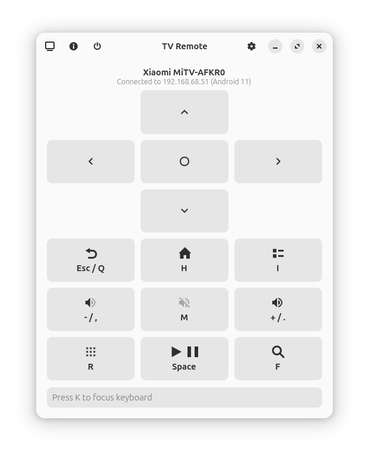
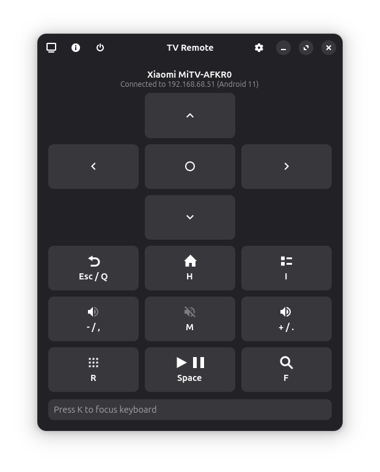

# TV Remote

A GTK-based remote control application for Android TV devices, powered by [scrcpy](https://github.com/Genymobile/scrcpy) and ADB. Control your TV from your Linux desktop with low-latency input, keyboard shortcuts, and an intuitive interface.


| Light Mode | Dark Mode |
| :---: | :---: |
|  |  |

## Usage


[▶️ Watch Usage Demo](screenshots/usage.mp4)

## Features

- **Network Scanning**: Auto-discovers Android TV devices on your local network by scanning for hosts with ADB port (5555) open
- **ADB Connection**: Pure-Python ADB client with RSA key authentication
- **Auto-Connect**: Remembers and connects to the last successful device on startup
- **Remote Control UI**: Full-featured remote with D-pad, Home/Back/Menu, volume controls, power, and media buttons
- **Extended Media Controls**: Rewind, Fast Forward, Skip Previous/Next, and Subtitles
- **Advanced TV Controls**: TV Input switch, Channel Up/Down, Guide, Info, and colored keys (Red/Green/Yellow/Blue)
- **Number Pad**: On-screen numpad for direct channel entry
- **App Launcher**: Browse and launch all installed applications on your TV
- **App Switcher**: Quickly switch between recent apps with Ctrl+Tab
- **Screenshot Capture**: Take screenshots from your TV (Ctrl+S)
- **Device Status**: Real-time display of screen state, volume level, and memory usage
- **Keyboard Shortcuts**: Control your TV with keyboard shortcuts (all configurable)
- **Text Input**: Type text directly to your TV for search and input fields
- **Low-Latency Input**: Uses scrcpy-server technology for fast input response (~35-70ms)

## Keyboard Shortcuts

All shortcuts are configurable through the Preferences dialog.

| Key | Action |
| --- | --- |
| Arrow Keys / W A S D | Navigate (Up/Down/Left/Right) |
| Enter / E | OK / Select |
| Esc / Q | Back |
| H | Home |
| I | Menu |
| R | Apps |
| G | Google Assistant |
| Space | Play/Pause |
| Z | Previous |
| X | Next |
| M | Mute |
| + or . | Volume Up |
| - or , | Volume Down |
| Delete | Power |
| C | Captions/Subtitles |
| F | Search (YouTube) |
| K | Focus Keyboard |
| Ctrl+Tab | App Switcher (switch between recent apps) |
| Ctrl+A | App Launcher (view all installed apps) |
| Ctrl+S | Take Screenshot |

## Installation

### Flatpak (Recommended)

```bash
# Build and install locally
flatpak-builder --user --install --force-clean build-dir flatpak/io.github.erenseymen.android-tv-remote.yml

# Run
flatpak run io.github.erenseymen.android-tv-remote
```

### Requirements

The application runs in a Flatpak sandbox and includes all dependencies. The build requires:
- `flatpak`
- `flatpak-builder`

## Setup

1. Enable **Developer options** on your Android TV
2. Enable **USB debugging** or **Wireless debugging**  
3. Ensure ADB over network is enabled on **port 5555** (some TVs may need `adb tcpip 5555` via USB first)
4. On first connection, accept the "Allow USB debugging?" authorization prompt on the TV

## Tested Devices

- **Xiaomi TV Box S (2nd Gen)** - [Product page](https://www.epey.com/medya-oynatici/xiaomi-tv-box-s-2nd-gen.html)

## Project Structure

```
android-tv-remote/
├── src/gnome_adb_tv_remote/
│   ├── core/               # Core functionality
│   │   ├── adb_client.py      # ADB TCP client
│   │   ├── keystore.py        # RSA key generation
│   │   ├── network_info.py    # Network interface discovery
│   │   ├── scanner.py         # Subnet scanning
│   │   └── scrcpy_controller.py  # Low-latency input via scrcpy-server
│   ├── ui/                 # User interface
│   │   ├── main_window.py     # Main application window
│   │   ├── device_dialog.py   # Device discovery dialog
│   │   ├── remote_panel.py    # Remote control widget
│   │   ├── preferences_dialog.py  # Keyboard shortcuts configuration
│   │   ├── app_launcher_dialog.py # Installed apps browser
│   │   └── app_switcher_dialog.py # Recent apps switcher
│   ├── app.py              # Application entry point
│   └── __main__.py         # Module entry point
├── data/                   # Desktop and schema files
├── flatpak/                # Flatpak build manifest
└── pyproject.toml          # Python package configuration
```

## Dependencies

- **[PyGObject](https://gitlab.gnome.org/GNOME/pygobject)** (GTK4/Libadwaita) - UI framework
- **[adb-shell](https://github.com/JeffLIrion/adb_shell)** - Pure Python ADB protocol (connect, auth, shell commands, file push)
- **[android-tools](https://developer.android.com/studio/releases/platform-tools)** (adb binary) - Port forwarding and subprocess management for scrcpy
- **[psutil](https://github.com/giampaolo/psutil)** - Network interface enumeration for device scanning
- **[rsa](https://github.com/sybrenstuvel/python-rsa)** / **[pyasn1](https://github.com/pyasn1/pyasn1)** - RSA key generation (lighter than `cryptography` for Flatpak)
- **[scrcpy-server](https://github.com/Genymobile/scrcpy)** (bundled) - Low-latency input injection (~35-70ms)

## License

This project is licensed under the **GNU General Public License v3.0**. See the [LICENSE](LICENSE) file for details.

Third-party component licenses are documented in [THIRD-PARTY-LICENSES.md](THIRD-PARTY-LICENSES.md).
